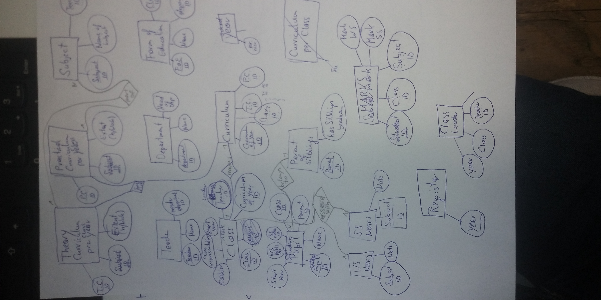
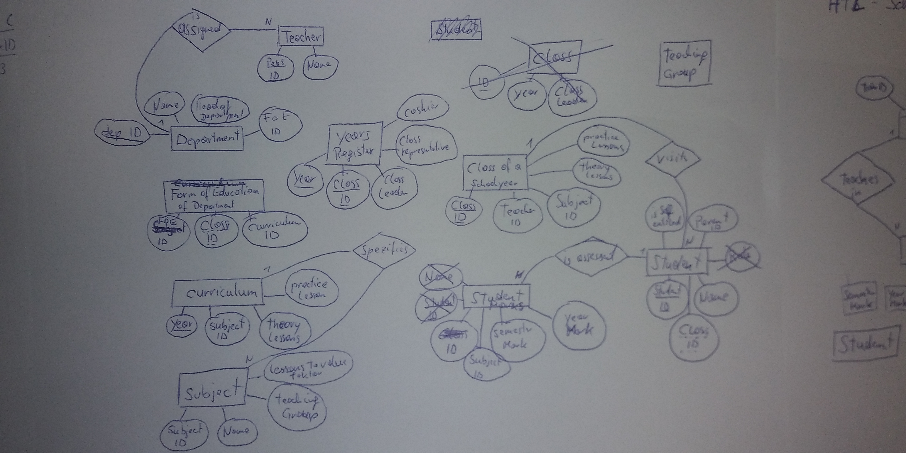
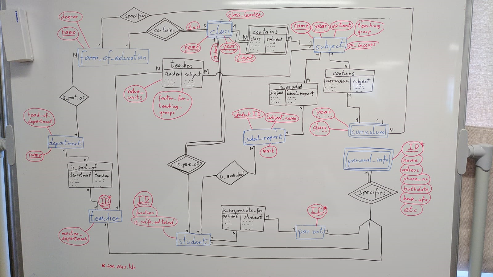
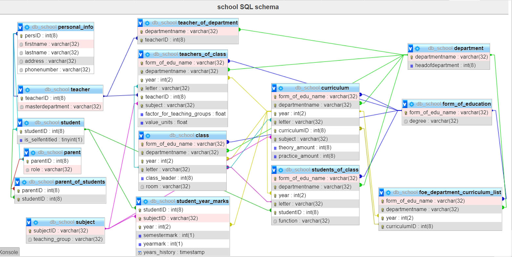

# SchoolERM

A school information system for an HTL is to be developed:
The departmental structure of an HTL is to be reproduced. Each teacher is assigned 
to a department as a master department, but can also teach in classes of other departments. 
Each department is headed by a teacher as head of department.
For each form of education of the departments, the curriculum specifies which subjects 
have to be taught in which year and to what extent (theory and practice lessons).
The classes of a school year are taught by the teachers in the individual subjects to a 
certain extent (theory and practice lessons). Each student is assessed with one semester 
and one year mark per class and subject. The system should be able to record this 
information for several school years.
It should be possible to find out the class leaders of the different classes, 
as well as by whom which functions (class representative, cashier, etc.) are or 
were exercised.
Teachers are not remunerated according to the number of hours they teach, but 
according to the value units they hold: Each subject is assigned to a specific 
compulsory teaching group (I to VI). A factor (1.167 to 0.75) is defined for 
each teaching obligation group, which is used to convert lessons into value units.
A parent is responsible for each pupil (unless the pupil is a self-entitled 
guardian). If siblings attend school, this should also be able to be determined.

### first solution

#### Own ERM:




#### Group ERM:



### second solution

#### ERM


#### textual notation

* teacher(***teacherID***:int(8),***masterdepartment***:varchar(32))

* personal_info(**persID:int(8)**, firstname:varchar(32), lastname:varchar(32),address:varchar(32),phonenumber:varchar(32))

* department(**departmentname**:varchar(32),*headofdepartment*:int(8))

* teacher_of_department(***departmentname***:varchar(32),***teacherID***:int(8))

* form_of_education(**form_of_edu_name**:varchar(32), degree:varchar(32) )

* foe_department_curriculum_list(***form_of_edu_name***:varchar(32), ***departmentname***:varchar(32),  ***year***:int(2),***curriculumID***:int(8))

* curriculum(***form_of_edu_name***:varchar(32), ***departmentname***:varchar(32),  ***year***:int(2),***letter***:varchar(32), ***curriculumID***:int(8), ***subject***:varchar(32), theory_amount:int(8), practice_amount:int(8))

* class(***form_of_edu_name***:varchar(32), ***departmentname***:varchar(32),  ***year***:int(2),***letter***:varchar(32),*class_leader*:int(8), room:varchar(32))

* teachers_of_class(***form_of_edu_name***:varchar(32), ***departmentname***:varchar(32),  ***year***:int(2),***letter***:varchar(32), ***teacherID***:int(8),***subject***:varchar(32), factor_for_teaching_groups:float(24),value_units:float(24))

* subject(***subjectID***:varchar(32), teaching_group:varchar(32))

* student(***studentID***:int(8), is_selfentitled:boolean)

* students_of_class(***form_of_edu_name***:varchar(32), ***departmentname***:varchar(32),  ***year***:int(2),***letter***:varchar(32),***studentID***:int(8),function:varchar(32))

* student_year_marks(***studentID***:int(8), ***subjectID***:varchar(32), ***year***:int(2), semestermark:int(1), yearmark:int(1), years_history:timestamp)

* parent(***parentID***:int(8), role:varchar(32))

* parent_of_students(***parentID***:int(8), ***studentID***:int(8))

#### SQL

[Link SQL-file](db_school.sql)

```
CREATE TABLE teacher( teacherID int(8), masterdepartment varchar(32), PRIMARY KEY(teacherID));
CREATE TABLE personal_info( persID int(8), firstname varchar(32), lastname varchar(32), address varchar(32), phonenumber varchar(32), PRIMARY KEY(persID));
CREATE TABLE department( departmentname varchar(32), headofdepartment int(8), PRIMARY KEY(departmentname));
CREATE TABLE teacher_of_department( departmentname varchar(32), teacherID int(8), PRIMARY KEY(departmentname, teacherID));
CREATE TABLE form_of_education( form_of_edu_name varchar(32), degree varchar(32), PRIMARY KEY(form_of_edu_name));
CREATE TABLE foe_department_curriculum_list( form_of_edu_name varchar(32), departmentname varchar(32), year int(2), curriculumID int(8), PRIMARY KEY(form_of_edu_name,departmentname, year, curriculumID));
CREATE TABLE curriculum( form_of_edu_name varchar(32), departmentname varchar(32), year int(2), letter varchar(32), curriculumID int(8), subject varchar(32), theory_amount int(8), practice_amount int(8), PRIMARY KEY(form_of_edu_name,departmentname, year, letter, curriculumID, subject));
CREATE TABLE class( form_of_edu_name varchar(32), departmentname varchar(32), year int(2), letter varchar(32), class_leader int(8), room varchar(32), PRIMARY KEY(form_of_edu_name,departmentname, year, letter));
CREATE TABLE teachers_of_class( form_of_edu_name varchar(32), departmentname varchar(32), year int(2), letter varchar(32), teacherID int(8), subject varchar(32), factor_for_teaching_groups float(24), value_units float(24), PRIMARY KEY(form_of_edu_name,departmentname, year, letter, teacherID, subject));
CREATE TABLE subject( subjectID varchar(32), teaching_group varchar(32), PRIMARY KEY(subjectID));
CREATE TABLE student( studentID int(8), is_selfentitled boolean, PRIMARY KEY(studentID));
CREATE TABLE students_of_class( form_of_edu_name varchar(32), departmentname varchar(32), year int(2), letter varchar(32), studentID int(8), function varchar(32), PRIMARY KEY(form_of_edu_name,departmentname, year, letter, studentID));
CREATE TABLE student_year_marks( studentID int(8), subjectID varchar(32), year int(2), semestermark int(1), yearmark int(1), years_history timestamp, PRIMARY KEY(studentID, subjectID, year));
CREATE TABLE parent( parentID int(8), role varchar(32), PRIMARY KEY(parentID));
CREATE TABLE parent_of_students( parentID int(8), studentID int(8), PRIMARY KEY(parentID, studentID));
```
